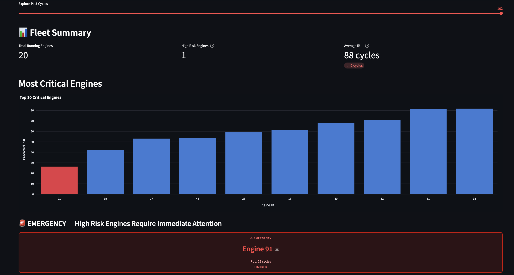
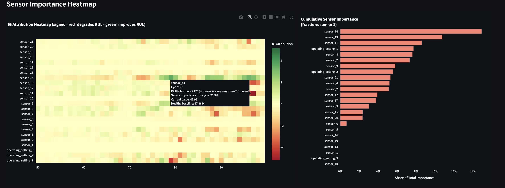
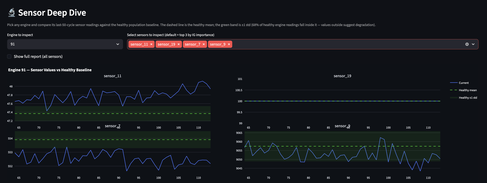
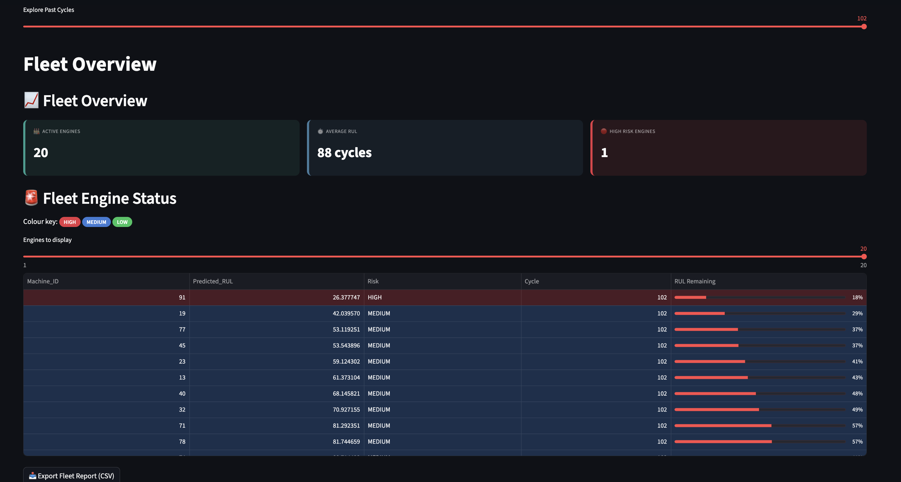
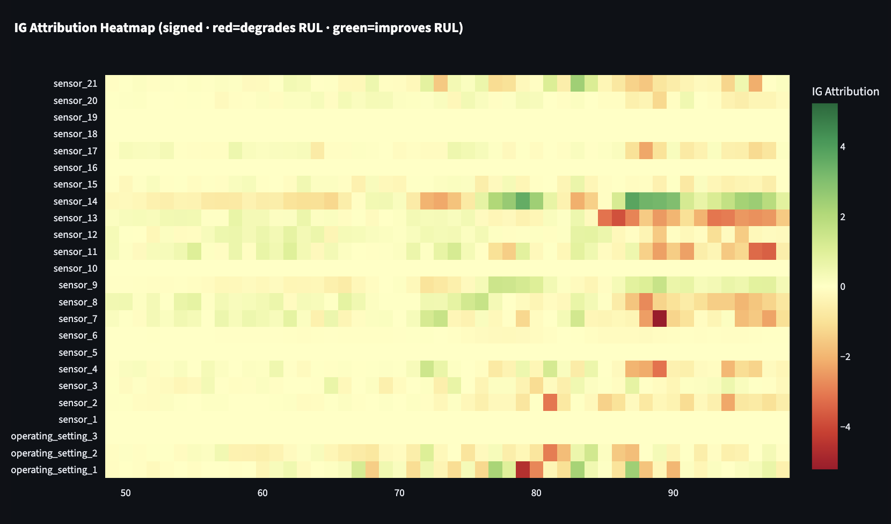
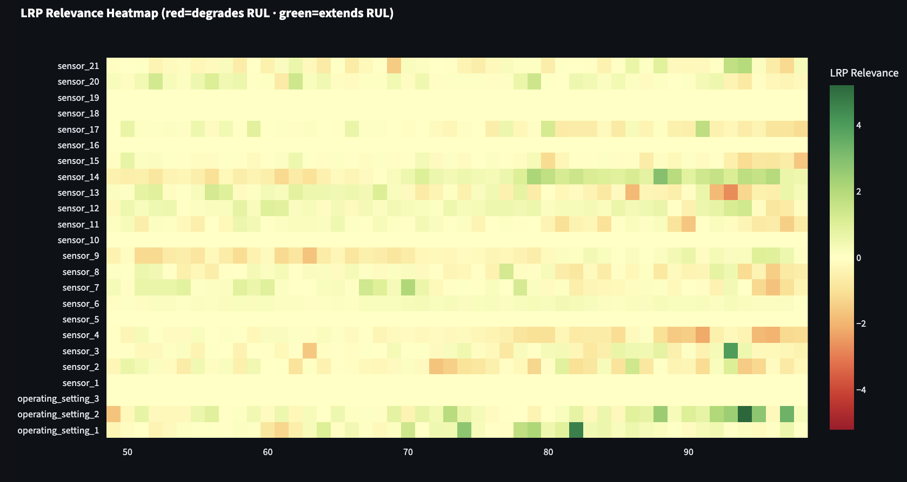
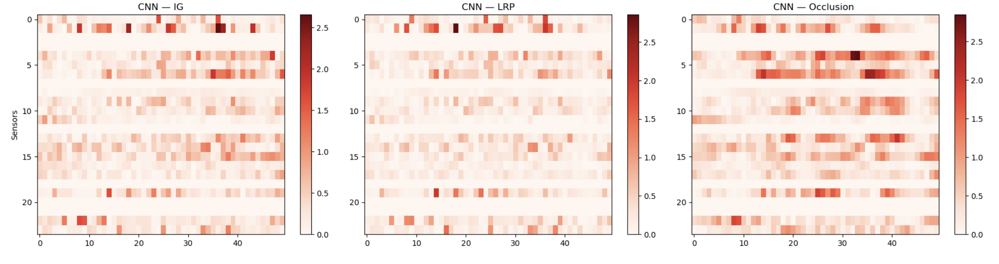
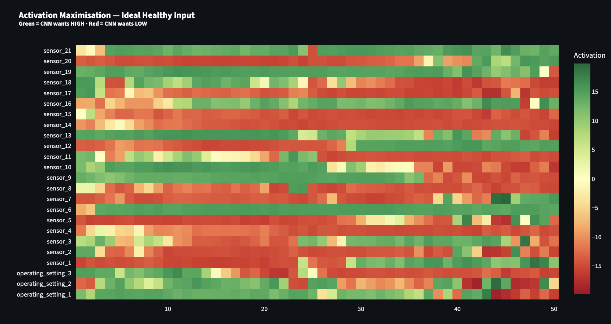
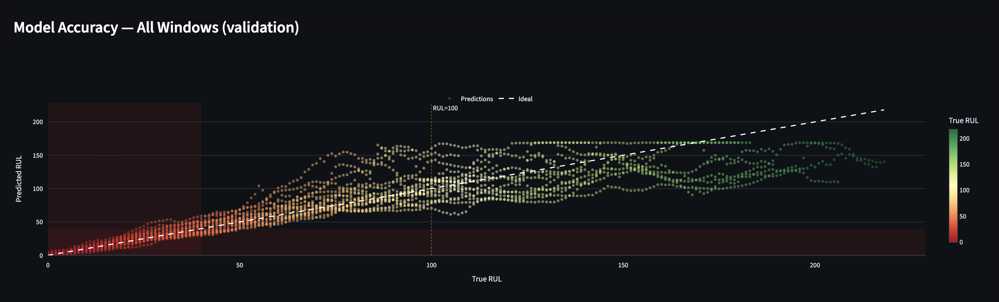

# Explainable Predictive Maintenance Dashboard

[](https://python.org)
[](https://pytorch.org)
[](https://YOUR-APP.streamlit.app)
[](LICENSE)

> A real-time predictive maintenance system that predicts the **Remaining Useful Life (RUL)** of turbofan engines and explains *why*, sensor by sensor, cycle by cycle.

**Live Demo → [Launch Dashboard](https://YOUR-APP.streamlit.app)**

---

## What This Does

Most predictive maintenance AI systems tell you *when* a machine will fail, but not *why* they think so. This project fixes that by combining accurate deep learning models with multiple explainability (XAI) methods, all wrapped in an interactive dashboard built for two types of users: **operations managers** who need a quick fleet overview, and **maintenance engineers** who need to drill down into sensor-level details.

The system is trained and evaluated on the **NASA CMAPSS** turbofan engine dataset (FD001–FD004).

---

## Dashboard Screenshots

### Home Tab — Live Fleet Overview

*Fleet KPI cards, ranked critical engines bar chart, and emergency alerts — all updating in real time.*

### Maintenance Engineer Tab — XAI Deep Dive

*The tab automatically loads the most urgent engine in the fleet. The IG attribution heatmap (sensor × cycle) is paired with a cumulative attribution bar chart so engineers can see exactly which sensors, at which cycles, drove the prediction. A dropdown lets you switch to any engine in the fleet for a full side-by-side comparison.*


*Sensor deep dive view for the selected engine: each sensor's full history plotted against its healthy baseline band (±1σ). Sensors drifting outside the green band are immediately visible, letting engineers cross-check the XAI output against the raw data before taking action.*

### Operations Manager Tab — Fleet Risk Table

*Color-coded risk ranking table (red = HIGH, blue = MEDIUM, green = LOW) with a fleet health score and risk distribution chart.*

### Explainability — IG Attribution Heatmap

*Signed attribution heatmap: red cells flag sensor readings that are pushing the predicted RUL down (degradation), green cells show readings that support a longer life.*

### Explainability — LRP Heatmap (CNN)

*Layer-wise Relevance Propagation applied to the CNN model. The same sensor subset and late-cycle concentration as IG confirms the findings are robust.*

### XAI Method Comparison

*IG, Occlusion, and LRP side by side on the same engine — all three independently point to the same sensors and the same time window.*

### Activation Maximization — Healthy Mode Profile

*The synthetic sensor pattern the CNN has learned to associate with maximum remaining life. Used to generate per-sensor maintenance recommendations.*

### Model Performance — True vs Predicted RUL

*True vs predicted RUL scatter plot. Each point is one 50-cycle window. Red points (HIGH-risk) cluster tightly around the ideal diagonal.*

---

## Tech Stack

| Component | Technology |
|---|---|
| Deep Learning | PyTorch |
| Models | LSTM + Attention, 1D CNN, Hybrid CNN-LSTM-BiLSTM |
| XAI | Captum (Integrated Gradients, Occlusion, LRP), Activation Maximization |
| Dashboard | Streamlit + Plotly |
| Data | NASA CMAPSS FD001–FD004 |
| ML Utilities | scikit-learn, scipy |

---

## Project Structure

```
xai_predictive_maintenance/
│
├── src/dashboard/
│   ├── app.py            # Streamlit frontend — all UI, tabs, and Plotly charts
│   └── backend.py        # Data loading, model inference, and XAI computations
│
├── notebooks/
│   └── data_preprocessing.ipynb  # Model training, evaluation, and multi-dataset analysis
│
├── data/
│   ├── train_FD001.txt   # NASA CMAPSS training data (FD001–FD004)
│   ├── test_FD001.txt    # Test data (FD001–FD004)
│   ├── RUL_FD001.txt     # Ground-truth RUL for test set (FD001–FD004)
│   ├── model.pth         # Trained LSTM weights
│   ├── cnn_model.pth     # Trained CNN weights
│   └── hybrid_model.pth  # Trained Hybrid weights
│
├── assets/               # Screenshots for this README
├── requirements.txt
└── README.md
```

---

## Quick Start

### 1. Clone and install

```bash
git clone https://github.com/YOUR-USERNAME/xai_predictive_maintenance.git
cd xai_predictive_maintenance
pip install -r requirements.txt
```

### 2. Run the dashboard

```bash
cd src/dashboard
streamlit run app.py
```

The dashboard will open in your browser at `http://localhost:8501`. It loads pre-trained model weights from the `data/` folder automatically.

> **Note:** The dashboard requires `model.pth` (LSTM) and `cnn_model.pth` (CNN) to be present in `data/`. These are already included in the repository. If they are missing, run the notebook first (see below). You don't need to wait for the whole notebook to run , the dashboard will run completly fine after running the training cells for LSTM and CNN models, cells [20],[58] respectively.

---

## Training the Models

Open and run the notebook:

```bash
jupyter notebook notebooks/data_preprocessing.ipynb
```

The notebook is organized into these sections:

1. **Data Loading and Preprocessing** — loads CMAPSS FD001, computes RUL labels, applies StandardScaler, creates 50-cycle sliding windows with an 80/20 train/validation split
2. **LSTM + Attention Model** — trains a 2-layer LSTM with additive attention (121K parameters), saves `data/model.pth`
3. **1D CNN Model** — trains a convolutional model (57K parameters), saves `data/cnn_model.pth`
4. **Hybrid CNN-LSTM-BiLSTM** — trains the hybrid architecture (467K parameters), saves `data/hybrid_model.pth`
5. **XAI Analysis** — Integrated Gradients, Occlusion Sensitivity, LRP, Activation Maximization, and IG-Occlusion agreement
6. **Multi-Dataset Evaluation** — trains all three models on FD001–FD004, generates loss curves, scatter plots, and a cross-dataset comparison table

---

## Models

### LSTM with Attention
- 2-layer LSTM, hidden size 96, additive attention over 50 timesteps
- Attention mechanism highlights *which cycles* were most important for the prediction
- Explained using Integrated Gradients and Occlusion Sensitivity

### 1D CNN
- Two convolutional blocks (24→32→16 channels) followed by two fully connected layers
- Separate ReLU instances for LRP compatibility
- Explained using Layer-wise Relevance Propagation and Activation Maximization

### Hybrid CNN-LSTM-BiLSTM
- Three Conv1d layers (32→64→128 channels) extract local degradation features
- Three-layer LSTM captures long-range sequential dependencies
- Two-layer Bidirectional LSTM adds context from both directions
- FC regression head

---

## XAI Methods

| Method | Model | What it shows |
|---|---|---|
| Integrated Gradients | LSTM | Which sensor at which cycle pushed predicted RUL up or down |
| Occlusion Sensitivity | LSTM | How much each sensor, when masked, changes the prediction |
| IG-Occlusion Agreement | LSTM | Spearman correlation between IG and Occlusion sensor rankings  |
| Layer-wise Relevance Propagation | CNN | Relevance scores backpropagated through each layer |
| Activation Maximization | CNN | The synthetic sensor pattern the CNN considers maximally healthy |
| IG-LRP-Occlusion Agreement | CNN | Spearman correlation between (IG , LRP) , (IG , Occlusion) , (Occlusion , LRP ) sensor rankings 

---

## Dashboard Features

- **Live simulation** — cycle counter advances every 10 seconds, all views update automatically
- **Fleet overview** — KPI cards, ranked bar chart, emergency alerts for HIGH-risk engines
- **Per-engine XAI** — IG or LRP heatmap, temporal attention curve, cumulative sensor attribution
- **Sensor deep dive** — each sensor's full history plotted against its healthy baseline (±1σ)
- **Healthy-mode recommendations** — sensor-by-sensor raise/lower actions derived from activation maximization
- **Explanation report** — tabular XAI summary exportable as Excel (5 sheets) or CSV
- **Model performance tab** — scatter plots, confusion matrices, and IG-Occlusion agreement chart for any engine

---

## Dataset

The [NASA CMAPSS dataset](https://www.nasa.gov/content/prognostics-center-of-excellence-data-set-repository) simulates turbofan engine degradation. Each engine starts healthy and is monitored through multiple cycles until failure.

| Subset | Engines (train) | Conditions | Fault Modes |
|---|---|---|---|
| FD001 | 100 | 1 | 1 |
| FD002 | 260 | 6 | 1 |
| FD003 | 100 | 1 | 2 |
| FD004 | 248 | 6 | 2 |

Each record has 21 sensor readings, 3 operating settings, and a cycle index. RUL labels are capped at 125 cycles following standard practice.

---

## Results 

(FD001)

| Model | Val RMSE | Test RMSE | HIGH-risk RMSE | Test Accuracy |
|---|---|---|---|---|
| LSTM + Attention | 13.29 | 15.09 | 4.92 | 89.0% |
| 1D CNN | 13.60 | 16.43 | 6.48 | 87.0% |
| Hybrid | 11.44 | 13.22 | 5.009 | 92.0% |

(FD002)

| Model | Val RMSE | Test RMSE | HIGH-risk RMSE | Test Accuracy |
|---|---|---|---|---|
| LSTM + Attention | 14.84 | 14.45 | 6.22 | 85.3% |
| 1D CNN | 15.69 | 6.59 | 6.48 | 83.4% |
| Hybrid | 13.63 | 13.90 | 5.6 | 85.7% |

(FD003)

| Model | Val RMSE | Test RMSE | HIGH-risk RMSE | Test Accuracy |
|---|---|---|---|---|
| LSTM + Attention | 12.50 | 14.12 | 4.56 | 87.0% |
| 1D CNN | 12.39 | 15.12 | 6.51 | 88.0% |
| Hybrid | 11.67 | 15.91 | 4.58 | 87.0% |

(FD004)

| Model | Val RMSE | Test RMSE | HIGH-risk RMSE | Test Accuracy |
|---|---|---|---|---|
| LSTM + Attention |22.09 | 20.69 | 4.92 | 82.7% |
| 1D CNN | 19.87 | 18.94 | 6.48 | 82.7% |
| Hybrid | 17.69 | 15.92 | 5.009 | 84.3 % |


*HIGH-risk = windows where true RUL < 40 cycles. Accuracy = three-class risk label classification.*

---

## Citation

If you use this work, please cite:

```
Mostafa Ahmed, "Explainable Time Series Forecasting for Predictive Maintenance,"
Bachelor Thesis, German University in Cairo, 2026.
```

---

## Acknowledgements

- Supervisor: Dr. Amr Mohamed Saber
- NASA for the [CMAPSS dataset](https://www.nasa.gov/content/prognostics-center-of-excellence-data-set-repository)
- [Captum](https://captum.ai/) for XAI implementations

